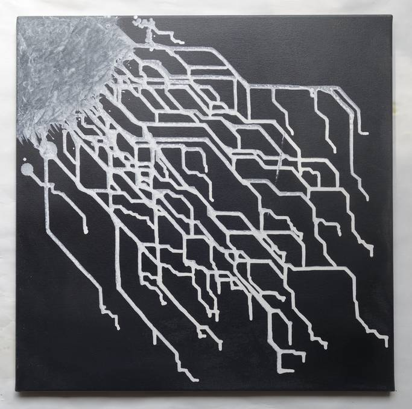
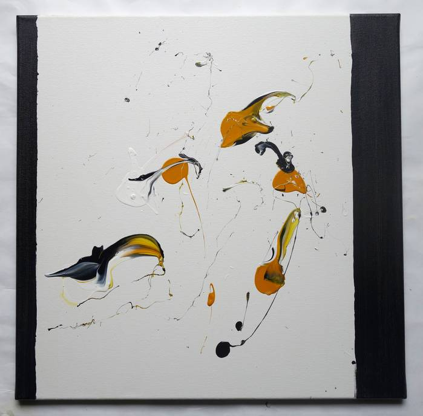
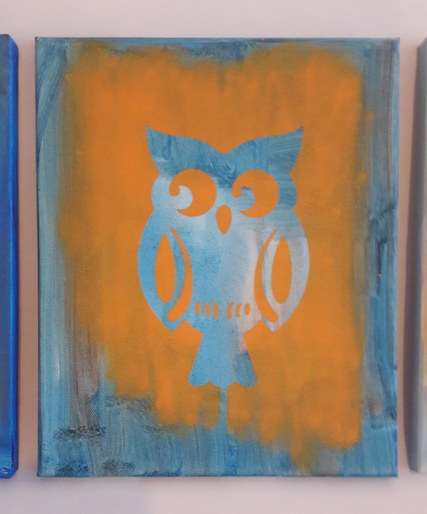
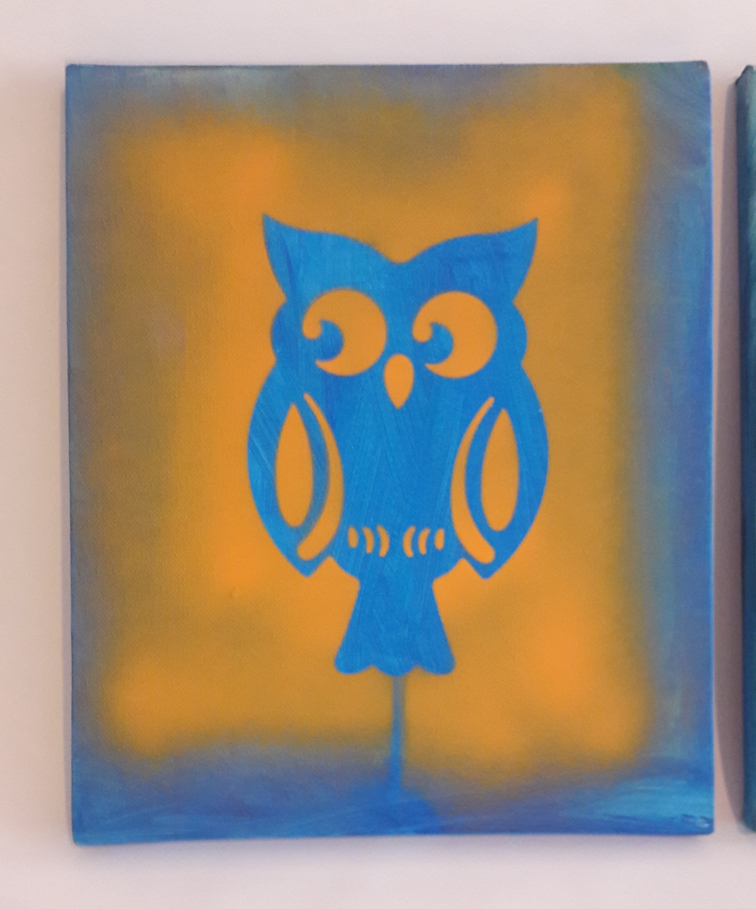
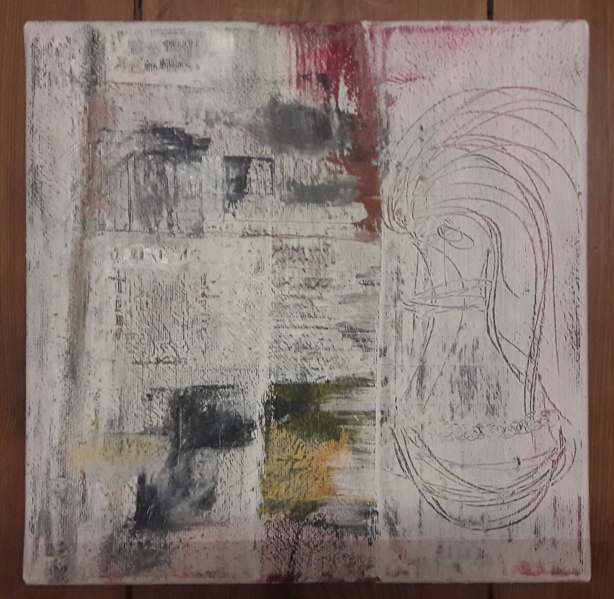

- terminus for modular framework parts
- recycling
- build process
- search for methodes and pattern

---
# 2020
## 079 - 
## 078 - 
## 077 - 
## 076 - 
## 075 - 
## 074 - 
## 073 - 
## 072 - 
## 071 - 
## 060 - 
## 059 -
## 058 -
## 057 -
## 056 -
## 055 -
## 054 -
## 053 -
## 052 - 

---
# 2019
## 051 - blau
## 050 - moon flower
## 049 - bruce lee
## 048 - tristesse 3
## 047 - spectrum
## 046 - x5 – black
## 045 - testbild
## 044 - wire

## 043 - wave
## 042 - x4 – chaos + order 
## 041 - x3 – explosion
## 040 - vogel party nacht
## 039 - vogel party abend
 
## 038 - walking dead 3
## 037 - walking dead 2
## 036 - sturm
## 035 - a berlin wall
## 034 - magenta
## 033 - perfecto
## 032 - x2 – toxic
## 031 - emoji
## 030 - blue square
## 029 - two

---
# 2018
## 028 - triangle
## 027 - blauer vogel
## 026 - walking dead 1
## 025 - doppel tee
## 024 - x1 – ortho
## 023 - kiss
## 022 - dansan
## 021 - ägyptologe
## 020 - 2 eulen
## 019 - eulenchen 3
## 018 - eulenchen 2

## 017 - eulenchen 1

## 016 - tiny creatures
## 015 - woven
## 014 - balkans

## 013 - tristesse 2

## 012 - volk
## 011 - tristesse
## 010 - mickey
## 009 - picknickdecke
## 008 - lili
## 007 - train

---
# 2017
## 006 - m
## 005 - f
## 004 - evolution
## 003 - computer sushi
## 002 - dusk

## 001 - dawn
