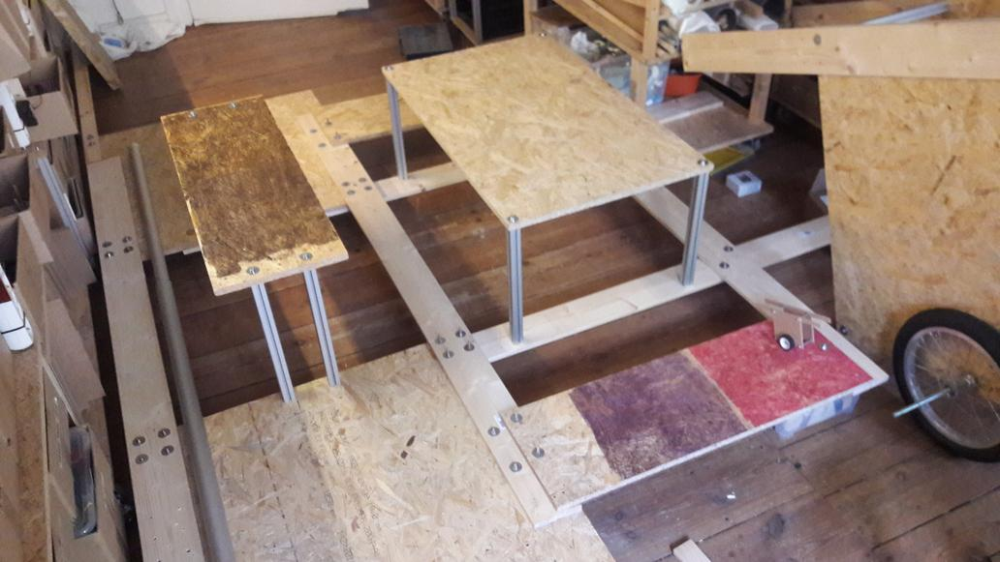

## basics
- started with design research study: a quest for floating structures
- a [first principle](https://en.wikipedia.org/wiki/First_principle) analysis leads to [archimedes' principle](https://en.wikipedia.org/wiki/Archimedes'_principle)
- 1 L of air displaces 1 L of water and can carry a payload of less than 1 kg

## floating elements
- barrel
- bottel
- boxes
- inflatables

## optimizing for
- price
- volume
- ...

## baldinho

## video
starting from 1:52:

